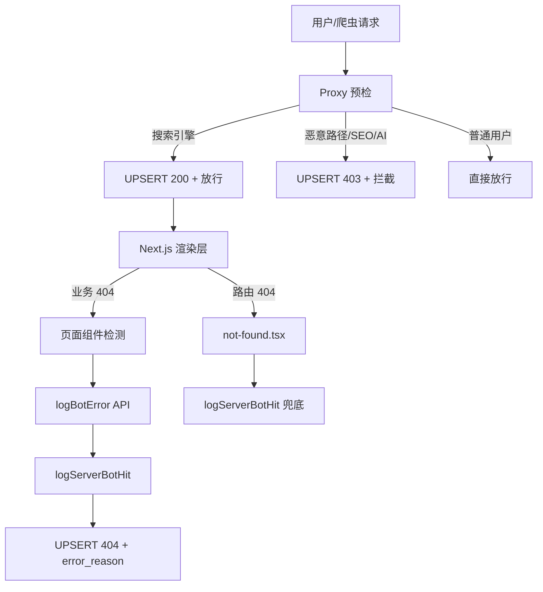

# 安全领域防御体系 (Security Domain)

本文档详细介绍了 Antigravity 项目的安全防御架构与审计策略。核心逻辑位于 `src/domains/security` 及边缘代理层。

## 1. 核心职责

- **流量审计 (核心)**: 识别并记录所有自动化（Bot）流量，区分合规爬虫与恶意扫描。
- **访问控制**: 由 Cloudflare 承接外部 WAF 防御；本地 `proxy.ts` 实施业务级 UAI 拦截作为二道防线。
- **SEO 健康监测**: 精准追踪死链来源，监控搜索引擎抓取状态。
- **5xx 错误归因**: 记录导致服务器错误的机器人请求，辅助系统稳定性优化。

> [!NOTE]
> **架构微调 (2026-01-27)**: 由于开启了 Cloudflare 代理 (Orange Cloud)，大部分恶意流量拦截已交由 Cloudflare 边缘节点处理。本地系统的职责已从“流量清洗”转向“深度审计与收录分析”。

## 2. 统一常量管理 (`src/domains/security/constants.ts`)

所有爬虫规则统一定义在 `constants.ts` 中，确保 Proxy 层、服务端日志和 Dashboard 看板使用相同的识别标准。

| 常量/函数                     | 用途                            |
| :---------------------------- | :------------------------------ |
| `UTILITY_BOTS_PATTERN`        | 工具类机器人正则（静默放行）    |
| `INTERNAL_WARMUP_PATTERN`     | Vercel 内部预热请求（静默放行） |
| `SEARCH_ENGINE_BOTS_PATTERN`  | 搜索引擎白名单正则              |
| `SEO_SCRAPER_BOTS_PATTERN`    | SEO 爬虫拦截正则                |
| `AI_ARCHIVE_BOTS_PATTERN`     | AI/Archive 机器人拦截正则       |
| `extractSearchEngineName(ua)` | 从 UA 提取搜索引擎名称          |
| `extractSeoScraperName(ua)`   | 从 UA 提取 SEO 爬虫名称         |
| `extractAiArchiveName(ua)`    | 从 UA 提取 AI 机器人名称        |

## 3. 架构组件

### 3.1 边缘代理 (`src/proxy.ts`)

作为全站流量的第一道防线，执行以下逻辑：

1.  **Geo-IP 识别**: 从 Vercel 边缘提取 `ip_country`，实现地理分析。
2.  **选择性审计 (Lean Audit)**:
    - **Cloudflare 拦截**: 大部分恶意路径、SEO/AI 爬虫由 Cloudflare WAF 直接阻断，此类请求**不记录**在本地 `bot_hits` 表中。
    - **本地兜底审计**: 漏网的恶意扫描或特定业务拦截（如 `.env`）仍由本地记录。
3.  **Header 对齐**: 优先读取 `cf-ipcountry` 获取精确的 Geo-IP 地理分析数据。
4.  **Header 注入**: 注入 `x-current-path` 和 `x-route-pattern` 供后续 404/5xx 页面获取原始请求路径。
4.  **精准命名**: 使用 `extractSeoScraperName()` 和 `extractAiArchiveName()` 提取具体 Bot 名称，如 `AhrefsBot`、`GPTBot`。
5.  **error_reason 写入**: 403 拦截时直接将分类原因写入数据库顶层的 `error_reason` 字段。

### 3.2 Bot 日志服务 (`src/domains/security/services/bot-logger.ts`)

负责将审计日志异步写入 Supabase。

- **非阻塞 (Fire-and-Forget)**: 使用异步调用，不增加用户主请求延迟。
- **单请求审计 (Single-Line Audit)**:
  - 采用 `request_id` (来自 `x-vercel-id`) 作为主键。
  - **初次记录**: Proxy 层识别爬虫后立即插入 (UPSERT) 一条 `status: 200` 的准入记录。
  - **后续更新**: 若后续业务逻辑触发 404 或 500，则使用相同的 `request_id` 更新该记录的状态及 `error_reason`。
- **日志范围**:
  - 403 (拦截)、404 (死链)、5xx (服务器错误)。
  - 搜索引擎的所有状态码访问。
- **噪音过滤**: 不记录普通用户的随机 404，保持日志高信噪比。
- **智能分类 (2026.01 新增)**:
  - `Mozilla/5.0` UA + 后台路径（如 `/admin`, `/login`）→ 归类为 `目录扫描`
  - `curl`, `wget`, `okhttp` 等工具 UA → 归类为 `脚本探测`
  - 其他 `Mozilla/5.0` UA → 归类为 `未知浏览器`（通常不记录）

### 3.3 轻量级错误日志工具 (`src/app/lib/server/log-bot-error.ts`)

用于页面组件在调用 `notFound()` 之前记录错误，**不调用 `headers()`**，因此不会触发动态渲染，保护 ISR。

```typescript
await logBotError('/article/xxx', 'Supabase异常: 连接超时');
notFound();
```

### 3.4 错误日志 API (`src/app/api/system/log-error/route.ts`)

接收来自 `logBotError()` 的 POST 请求，调用 `logServerBotHit()` 写入 Supabase。

### 3.5 管理员看板 (`src/app/admin/dashboard`)

可视化展示安全态势感知：

- **搜索审计**: 展示搜索引擎的 200/4xx/5xx 统计及异常路径详情。
- **安全防御**: 实时显示拦截次数、异常扫描路径 TOP 榜单。
- **颜色区分 (2026.01 新增)**: 403 拦截显示红色，404 探测显示淡紫色。

## 4. 404 错误捕捉架构



## 5. 关键业务流程 (以 404 为例)

1. Googlebot 访问旧链接 `/old-article`。
2. `proxy.ts` 识别为搜索引擎，UPSERT 200 记录，注入 `x-current-path` 和 `x-route-pattern` 并放行。
3. `/article/[id]/page.tsx` 查询数据库，发现文章不存在。
4. 调用 `logBotError('/article/xxx', '文章不存在: ID xxx')` 通过 API 记录。
5. 调用 `notFound()` 渲染 404 UI。
6. 管理员在看板看到 Googlebot 的 404 记录及对应路径和原因。

## 6. 数据库模型 (`bot_hits`)

| 字段           | 类型        | 说明                                               |
| :------------- | :---------- | :------------------------------------------------- |
| `request_id`   | text/PK     | 唯一请求 ID (来自 x-vercel-id 或 UUID)             |
| `bot_name`     | text        | 精确名称 (e.g. "GPTBot") 或 分类名 (e.g. "AI BOT") |
| `path`         | text        | 请求路径 (由 x-current-path 注入)                  |
| `status`       | int4        | HTTP 状态码 (200, 403, 404, 500)                   |
| `error_reason` | text        | 分类报错原因，见下方说明                           |
| `ip_country`   | text        | ISO 国家代码                                       |
| `user_agent`   | text        | 完整 UA 字符串                                     |
| `meta`         | jsonb       | 附加上下文 (referer, debug 信息等)                 |
| `created_at`   | timestamptz | 创建时间                                           |

### 6.1 Bot 命名与分类策略

系统采用 **"精准点名 + 智能兜底"** 的双层命名策略：

| 类别             | 精准识别示例                          | 兜底名称      |
| :--------------- | :------------------------------------ | :------------ |
| **搜索引擎**     | `Googlebot`, `Bingbot`, `Baiduspider` | `搜索引擎`    |
| **SEO 商业爬虫** | `AhrefsBot`, `SemrushBot`, `MJ12bot`  | `SEO商业爬虫` |
| **AI 机器人**    | `GPTBot`, `ClaudeBot`, `DeepSeek`     | `AI BOT`      |
| **恶意扫描**     | -                                     | `恶意扫描`    |
| **目录扫描**     | -                                     | `目录扫描`    |
| **脚本探测**     | `curl`, `wget`, `okhttp`              | `脚本探测`    |
| **未知爬虫**     | -                                     | `未知爬虫`    |

### 6.2 `error_reason` 分类规则

| 分类                | 格式                       | 含义                                   |
| :------------------ | :------------------------- | :------------------------------------- |
| **恶意路径扫描**    | `恶意路径扫描`             | 访问 `.env`, `wp-admin`, `.php` 等路径 |
| **SEO商业爬虫拦截** | `SEO商业爬虫拦截`          | SEO 爬虫被 403 拦截                    |
| **AI机器人拦截**    | `AI机器人拦截`             | AI 机器人被 403 拦截                   |
| **路由不存在**      | `路由不存在`               | 路径无对应路由（Edge 层无法识别）      |
| **Supabase异常**    | `Supabase异常: {错误信息}` | Supabase 数据库调用失败                |
| **FreshRSS异常**    | `FreshRSS异常: {错误信息}` | FreshRSS API 调用失败                  |
| **文章不存在**      | `文章不存在: ID xxx ...`   | 文章 ID 在两个服务中均未找到           |
| **数据不存在**      | `数据不存在: {原因}`       | 其他业务逻辑返回的 404                 |
| **API/内部绕过**    | `Supabase内部请求(API绕过)`| 绕过中间件的内部 API 请求 (如 pg_net)  |
| **爬虫尝试**        | `静态资源缺失或爬虫尝试`   | 疑似爬虫访问不存在的静态文件           |
| **静态资源缺失**    | `静态资源缺失或绕过`       | 正常浏览器访问缺失的静态文件           |

## 7. 维护说明

- **规则更新**: 仅需修改 `src/domains/security/constants.ts`，全站逻辑将自动同步。
- **表清理**: 可安全 `TRUNCATE TABLE bot_hits`。该表仅用于审计分析，不存储业务关键数据。
- **Dashboard RPC**: `get_bot_hits_name_distribution` 函数返回 `status_403_count` 和 `status_404_count` 分拆统计。
