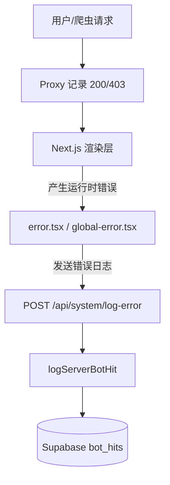

# 安全领域防御体系 (Security Domain)

本文档详细介绍了 Antigravity 项目的安全防御架构与审计策略。核心逻辑位于 `src/domains/security` 及边缘代理层。

## 1. 核心职责

- **流量审计**: 识别并记录所有自动化（Bot）流量，区分合规爬虫与恶意扫描。
- **访问控制**: 在 Edge 层（Middleware）实施 WAF 级别的 IP/UA 拦截和路径过滤。
- **SEO 健康监测**: 精准追踪死链来源，监控搜索引擎抓取状态。
- **5xx 错误归因**: 记录导致服务器错误的机器人请求，辅助系统稳定性优化。

## 2. 统一常量管理 (`src/domains/security/constants.ts`)

所有爬虫规则统一定义在 `constants.ts` 中，确保 Proxy 层、服务端日志和 Dashboard 看板使用相同的识别标准。

| 常量/函数                     | 用途                         |
| :---------------------------- | :--------------------------- |
| `UTILITY_BOTS_PATTERN`        | 工具类机器人正则（静默放行） |
| `SEARCH_ENGINE_BOTS_PATTERN`  | 搜索引擎白名单正则           |
| `SEO_SCRAPER_BOTS_PATTERN`    | SEO 爬虫拦截正则             |
| `AI_ARCHIVE_BOTS_PATTERN`     | AI/Archive 机器人拦截正则    |
| `extractSearchEngineName(ua)` | 从 UA 提取搜索引擎名称       |
| `isSearchEngine(ua)`          | 判断是否为搜索引擎           |

## 3. 架构组件

### 3.1 边缘中间件 (`src/proxy.ts`)

作为全站流量的第一道防线，执行以下逻辑：

1.  **Geo-IP 识别**: 从 Vercel 边缘提取 `ip_country`，实现地理分析。
2.  **选择性审计 (Lean Audit)**:
    - **静默放行**: 识别 Sentry, Vercel 等工具类机器人并直接放行，**不记录日志**。
    - **黑名单阻断**: 拦截高频 SEO 爬虫、AI 机器人及恶意路径扫描（`.env`, `wp-admin` 等）。
3.  **Header 注入**: 注入 `x-current-path` 供后续 404/5xx 页面获取原始请求路径。

### 3.2 Bot 日志服务 (`src/domains/security/services/bot-logger.ts`)

负责将审计日志异步写入 Supabase。

- **非阻塞 (Fire-and-Forget)**: 使用异步调用，不增加用户主请求延迟。
- **日志范围**:
  - 403 (拦截)、404 (死链)、5xx (服务器错误)。
  - 搜索引擎的所有状态码访问。
- **噪音过滤**: 不记录普通用户的随机 404，保持日志高信噪比。

### 3.3 管理员看板 (`src/app/admin/dashboard`)

可视化展示安全态势感知：

- **搜索审计**: 展示搜索引擎的 200/4xx/5xx 统计及异常路径详情。
- **安全防御**: 实时显示拦截次数、异常扫描路径 TOP 榜单。

## 4. 5xx 错误捕捉架构

系统通过 Next.js 错误边界捕获致命错误，并归因到具体的 Bot 请求。

## 5. 关键业务流程 (以 404 为例)

1. Googlebot 访问旧链接 `/old-article`。
2. `proxy.ts` 识别为搜索引擎，注入 `x-current-path: /old-article` 并放行。
3. 路由匹配失败，渲染 `not-found.tsx`。
4. `not-found.tsx` 调用 `logServerBotHit`。
5. 管理员在看板看到 Googlebot 的 404 记录及对应路径。

## 6. 数据库模型 (`bot_hits`)

| 字段         | 类型 | 说明                                   |
| :----------- | :--- | :------------------------------------- |
| `bot_name`   | text | 归类名称 (e.g., "Googlebot", "AI-Bot") |
| `path`       | text | 请求路径 (由 x-current-path 注入)      |
| `status`     | int4 | HTTP 状态码 (200, 403, 404, 500)       |
| `ip_country` | text | ISO 国家代码                           |

## 7. 维护说明

- **规则更新**: 仅需修改 `src/domains/security/constants.ts`，全站逻辑将自动同步。
- **表清理**: 可安全 `TRUNCATE TABLE bot_hits`。该表仅用于审计分析，不存储业务关键数据。
